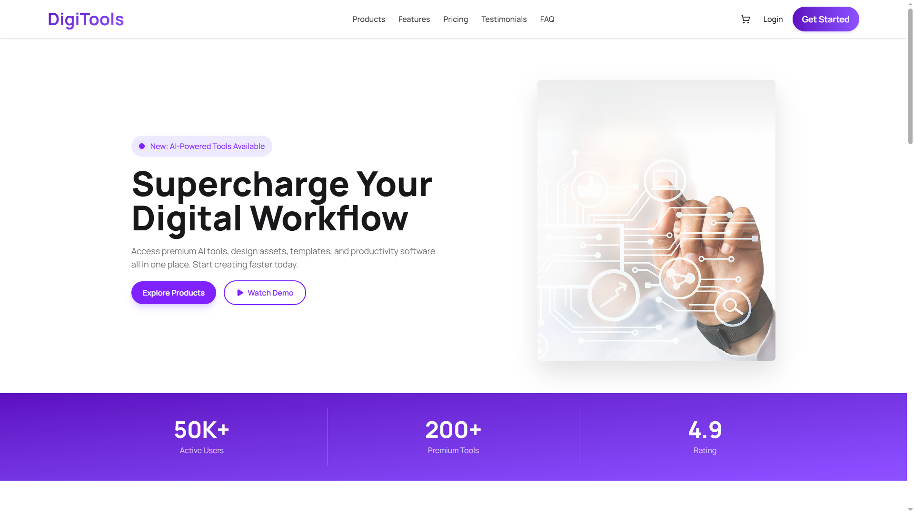
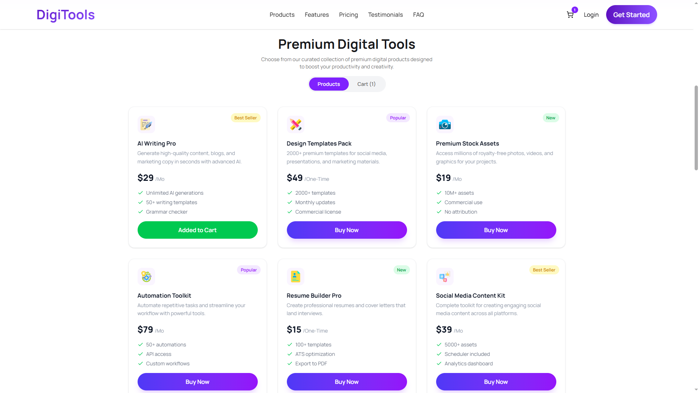
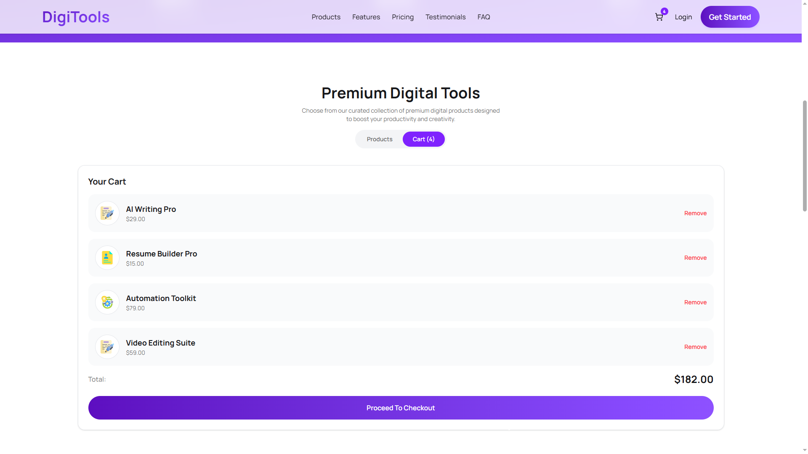

<div align="center">

# 🛠️ DigiTools Platform

### Premium Digital Tools Marketplace

A sleek, modern digital product storefront where users can browse premium tools, add items to cart, manage their selections, and proceed to checkout — all within a polished single-page experience.

[](https://digitools-plat.vercel.app/)
[](https://react.dev/)
[](https://vitejs.dev/)
[](https://tailwindcss.com/)
[](https://digitools-plat.vercel.app/)

</div>

---

## 📸 Preview

<p align="center">
  
</p>

<p align="center">
  
</p>

<p align="center">
  
</p>

> **🔗 Live Site:** [https://digitools-plat.vercel.app/](https://digitools-plat.vercel.app/)

---

## ✨ Features

| Feature | Description |
| :--- | :--- |
| 🛒 **Smart Cart System** | Add products to cart with real-time badge updates on the navbar cart icon |
| 🔄 **Cart Management** | Remove individual items from cart with instant UI updates and toast feedback |
| 💳 **Checkout Flow** | Proceed to checkout to reset the cart with a success notification |
| 🏷️ **Product Tags** | Visual badges for Best Seller, Popular, and New products |
| 💰 **Pricing Display** | Clear pricing with monthly/one-time period labels and formatted totals |
| 📦 **Product Catalog** | Browse 9 premium digital tools with descriptions, features, and pricing |
| 🎯 **Three-Step Process** | Clear onboarding flow: Create Account → Choose Products → Start Creating |
| 💎 **Transparent Pricing Plans** | Three-tier pricing (Starter, Pro, Enterprise) with feature comparison |
| 📱 **Fully Responsive** | Optimized layout for desktop, tablet, and mobile screen sizes |
| 🔔 **Toast Notifications** | Instant feedback for add to cart, remove, duplicate, and checkout actions |

---

## 🛠️ Tech Stack

<div align="center">

| Technology | Purpose |
| :---: | :---: |
| **React 19** | Component-driven UI with modern `use()` and `Suspense` patterns |
| **Vite 8** | Fast local development and optimized production builds |
| **Tailwind CSS 4** | Utility-first styling and responsive layout system |
| **DaisyUI 5** | Prebuilt UI primitives for navbar and layout components |
| **Lucide React** | Clean, consistent SVG icon library |
| **React Toastify** | Toast notifications for user interaction feedback |
| **React Icons** | Social media icons for the footer section |
| **Local JSON Data** | Product data served from `public/data.json` |
| **Vercel** | Live deployment and hosting |

</div>

---

## 🚀 Getting Started

### Prerequisites

- **Node.js** `v18+`
- **npm** `v9+`

### Installation

1. **Clone the repository**

   ```bash
   git clone <your-repository-url>
   cd PHA6-DigiTools-Platform
   ```

2. **Install dependencies**

   ```bash
   npm install
   ```

3. **Start the development server**

   ```bash
   npm run dev
   ```

4. **Open in your browser**

   Navigate to `http://localhost:5173` to view the app locally.

### Build for Production

```bash
npm run build
```

The optimized output will be generated in the `dist/` directory.

### Lint the Project

```bash
npm run lint
```

---

## 📁 Project Structure

```text
PHA6-DigiTools-Platform/
├── public/
│   ├── data.json
│   ├── favicon.svg
│   ├── icons.svg
│   ├── Preview1.png
│   ├── Preview2.png
│   └── Preview3.png
├── src/
│   ├── assets/
│   │   ├── banner.png
│   │   ├── hero.png
│   │   ├── package.png
│   │   ├── Play.png
│   │   ├── rocket.png
│   │   ├── user.png
│   │   └── products/
│   ├── components/
│   │   ├── Activity.jsx
│   │   ├── Banner.jsx
│   │   ├── Footer.jsx
│   │   ├── Navbar.jsx
│   │   ├── Pricing.jsx
│   │   ├── Process.jsx
│   │   ├── Tools.jsx
│   │   └── Workflow.jsx
│   ├── ui/
│   │   ├── Cart.jsx
│   │   └── ProductCard.jsx
│   ├── App.jsx
│   ├── index.css
│   └── main.jsx
├── index.html
├── package.json
├── vite.config.js
└── README.md
```

---

## 🎨 Design Highlights

- **Gradient-rich hero banner** with animated text and layered visual depth
- **Hover-lift product cards** with smooth shadows and gradient CTA buttons
- **Real-time cart badge** on the navbar with violet accent styling
- **Professional empty cart state** with icon, messaging, and clean layout
- **Three-tier pricing section** with a highlighted "Most Popular" gradient card
- **Step-by-step process section** with numbered badges and icon illustrations
- **Full-width CTA workflow section** with dual action buttons
- **Dark-themed footer** with organized link columns and social media icons

---

## 📦 Data Source

This project uses a local product dataset stored in:

```text
public/data.json
```

Each product entry includes:

- Name
- Description
- Price
- Billing period (monthly / one-time)
- Tag & tag type
- Feature list
- Product icon URL

---

## 🌐 Deployment

The application is deployed on **Vercel**:

**Live URL:** [https://digitools-plat.vercel.app/](https://digitools-plat.vercel.app/)

---

<div align="center">

**⭐ If you found this project useful, consider giving it a star!**

Made with ❤️ using React, Vite, Tailwind CSS, and DaisyUI

</div>
